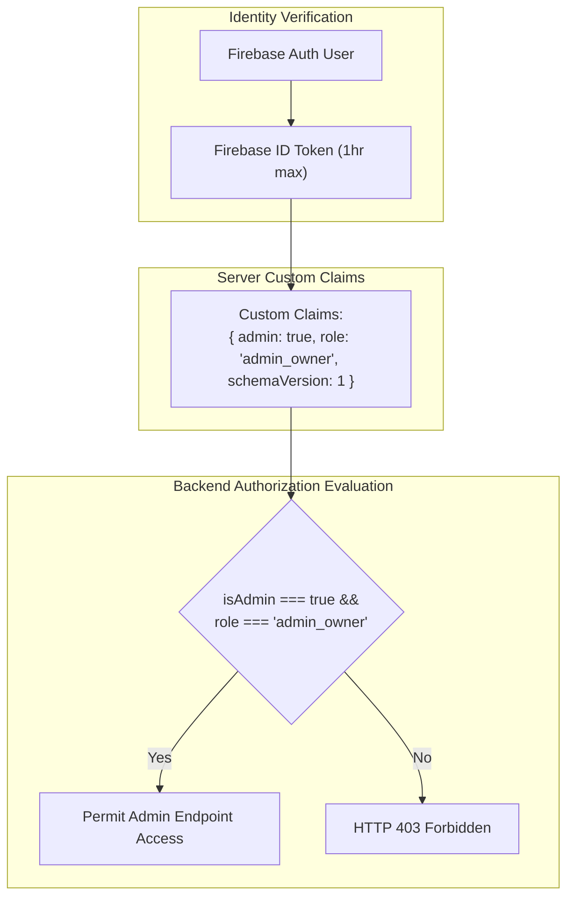

# Admin Identity, Role, and Permission Model

**System**: Satwik Sweets and Pickels (`satvik-spot`)  
**Date**: July 22, 2026  
**Scope**: Server-Authoritative Identity and Authorization Design  

---

## 1. Minimal Identity & Role Model Specification

To prevent privilege sprawl and backdoor roles, the system supports a minimal, server-authoritative role model consisting of exactly two role tiers:

1. **`customer`**: Standard end-user storefront account (default role when custom claims are absent or empty). Has zero administrative privileges.
2. **`admin_owner`**: Exactly one supported owner-level administrator identity. Possesses administrative access to dashboard metrics, product management, review moderation, message handling, and audit logs.

---

## 2. Server-Authoritative Principles

1. **Canonical Identity Source**: Firebase Authentication UID is the sole canonical identity identifier (`decoded.uid`).
2. **Server Custom Claims Only**: Administrative authority is granted **exclusively** via server-issued Firebase Auth Custom Claims (`{ admin: true, role: 'admin_owner', schemaVersion: 1 }`).
3. **No Email-Based Authorization**: A Firebase email address alone (e.g. `admin@satvikspot.com`) does **not** grant administrative privileges.
4. **No Firestore Profile Authorization**: Firestore user profile documents (`/users/{uid}`) cannot grant or override administrative authority.
5. **No Frontend LocalStorage Authority**: Browser local storage flags (e.g. `isAdmin: true` or `role: 'owner'`) are completely ignored by the backend API.
6. **No Client-Submitted Claims**: Request bodies, query parameters, or client headers containing role or claim data are strictly untrusted and rejected.
7. **Single Owner Rule**: Only one Firebase Authentication account is permitted to hold the `admin_owner` role initially.
