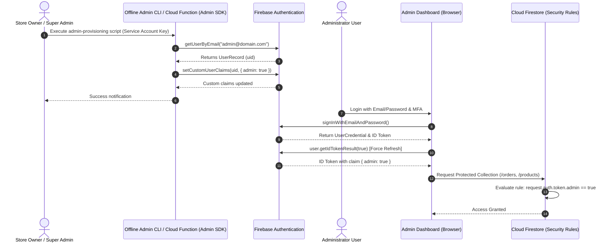

# ADMIN PROVISIONING AND SECURITY GUIDE

**System**: Satwik Sweets and Pickels  
**Scope**: Trusted Administrator Lifecycle, Custom Claims, MFA & Access Management  
**Date**: July 19, 2026  

---

## 1. Executive Security Architecture

In accordance with modern security standards, **browser-side JavaScript must never possess the authority to declare or mutate administrative roles**. Storing an `admin: true` flag in a Firestore document editable by users, or relying on client `localStorage` / `sessionStorage`, is inherently insecure.

Administrative privilege in Satwik Sweets and Pickels is governed by **Firebase Authentication Custom User Claims** (`request.auth.token.admin == true`), which can **only** be modified using the **Firebase Admin SDK** running within a trusted, server-side execution environment (such as Google Cloud Functions, Cloud Run, or a secure admin CLI tool running offline with service account credentials).

---

## 2. Trusted Admin Provisioning Workflow



---

## 3. Step-by-Step Implementation Guide

### A. Initial Administrator Creation
1. The target administrator user must first register an account through standard Firebase Authentication using a secure email and strong password.
2. The account UID is recorded from the Firebase Auth Console or User Record.

### B. Custom Claim Assignment Script (Node.js Admin SDK)

```javascript
// scripts/set-admin-claim.js
// MUST BE EXECUTED ONLY IN A TRUSTED SERVER OR OFFLINE ENVIRONMENT
const admin = require('firebase-admin');

// Service account credentials stored in environment, NEVER in repository
const serviceAccount = JSON.parse(process.env.FIREBASE_SERVICE_ACCOUNT_KEY);

admin.initializeApp({
  credential: admin.credential.cert(serviceAccount)
});

async function grantAdminRole(email) {
  try {
    const user = await admin.auth().getUserByEmail(email);
    await admin.auth().setCustomUserClaims(user.uid, { admin: true });
    console.log(`✅ Successfully granted admin claim to ${email} (UID: ${user.uid})`);
  } catch (error) {
    console.error(`❌ Error setting custom claim:`, error);
  }
}

grantAdminRole('admin-email@example.com');
```

---

### C. Client-Side Token Refresh
Custom claims are embedded in the user's Auth ID Token (JWT). When an account is granted the `admin` claim, the browser must force a token refresh to acquire the updated JWT payload containing `admin: true`:

```javascript
// Browser JS execution after login
firebase.auth().onAuthStateChanged(async (user) => {
  if (user) {
    // Force token refresh to fetch latest custom claims
    const idTokenResult = await user.getIdTokenResult(true);
    if (idTokenResult.claims.admin === true) {
      console.log("🔐 Authenticated as Verified Admin");
      // Render admin UI controls
    } else {
      console.warn("⚠️ Standard user login - Admin access denied");
    }
  }
});
```

---

### D. Administrator Revocation & Removal
To revoke administrative privileges:

```javascript
// scripts/revoke-admin-claim.js
async function revokeAdminRole(uid) {
  // 1. Remove custom claim
  await admin.auth().setCustomUserClaims(uid, { admin: false });
  // 2. Revoke all active refresh tokens for immediate session termination
  await admin.auth().revokeRefreshTokens(uid);
  console.log(`⛔ Admin privileges revoked and sessions terminated for UID: ${uid}`);
}
```

---

## 4. Operational & Security Controls

### A. Multi-Factor Authentication (MFA)
- Mandatory enrollment in SMS or Time-based One-Time Password (TOTP) MFA for all accounts possessing the `admin: true` claim.
- Enforcement configured in Firebase Auth Security Settings.

### B. Emergency Account Recovery
- Minimum of **two** authorized super-administrator service accounts kept in cold offline storage.
- Key rotation policy enforced every 90 days.

### C. Security Audit Logging
- Every privilege grant, revocation, and failed administrative login attempt logged to **Google Cloud Audit Logs / Stackdriver**.
- Cloud Monitoring alerts configured for any authorization failure event.

---
*End of Admin Provisioning Guide.*
