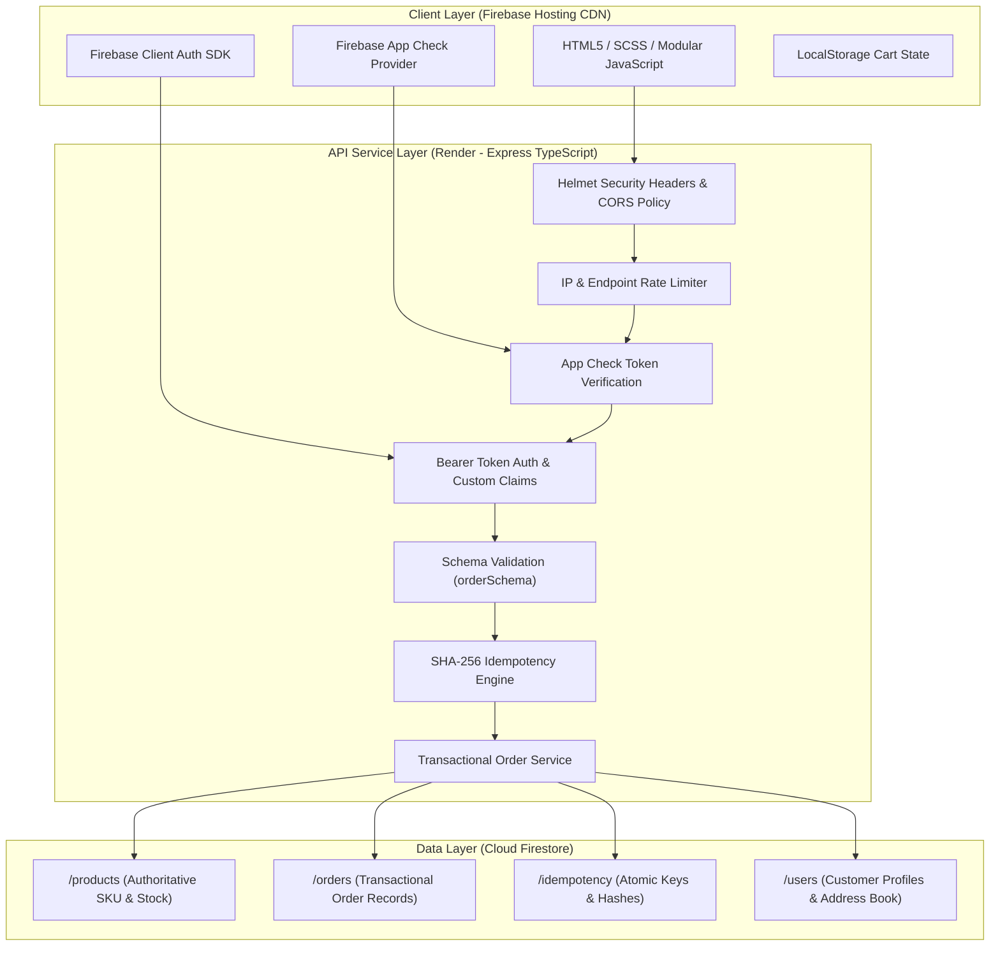

# Satvik Swaad System Architecture

This document describes the technical architecture, design decisions, and engineering trade-offs of the Satvik Swaad e-commerce platform.

---

## 1. Architecture Overview

The system employs a decoupled, three-tier architecture:

1. **Frontend Presentation Tier (Firebase Hosting)**:
   - Static client assets (HTML5, SCSS/CSS, ES6+ JavaScript modules) served directly via Firebase Hosting CDN.
   - Client-side state handling for shopping cart persistence (Local Storage) and Google Identity authentication.
   - Direct integration with Firebase App Check to generate attestation tokens for backend requests.

2. **Application & API Service Tier (Node.js / Express / TypeScript on Render)**:
   - Stateless REST API deployed on Render running Node.js 22 and TypeScript in strict mode.
   - Enforces request validation schemas, rate limiting, App Check token verification, authenticated session claims, and transaction coordination.
   - Implements transactional checkout logic, guest token verification, and administrative audit logging.

3. **Database & Storage Tier (Google Cloud Firestore)**:
   - Managed NoSQL document database (Firestore in native mode) with encryption at rest.
   - Authoritative data stores for `/users`, `/products`, `/orders`, and `/idempotency`.
   - Security rules and transactional write constraints enforce consistency and isolation.

---

## 2. Core Design Decisions

### 2.1 Decoupled Hosting and Compute
- **Static Assets on Firebase Hosting**: Fast global CDN distribution, low TTFB (Time to First Byte), and zero compute execution overhead for browsing product pages.
- **Compute on Render**: Isolates backend business logic, payment handling, and database credentials from public static assets, enabling targeted scaling and independent deployment pipelines.

### 2.2 Atomic Firestore Transactions for Inventory Updates
- Multi-item checkout requests execute inside atomic `db.runTransaction()` blocks.
- Product availability and stock quantities are read within the transaction. If requested quantity exceeds current stock, the transaction aborts with an `OutOfStockError`, preventing overselling and race conditions under concurrent checkouts.

### 2.3 SHA-256 Payload Idempotency Keys
- Every order submission includes an `idempotencyKey` and a deterministic SHA-256 hash of the canonical request payload (customer name, phone, shipping address, payment method, and sorted item IDs).
- Stored records in `/idempotency/{key}` bind the key to the request hash, caller identity, and initial response.
- Re-transmissions of identical requests return the cached result payload without re-decrementing inventory or creating duplicate orders. Payload modifications with the same key are rejected with a 409 conflict error.

### 2.4 App Check Attestation Token Enforcement
- Critical backend mutation routes verify the `X-Firebase-AppCheck` request header using `admin.appCheck().verifyToken()`.
- Validates that requests originate from the registered web client domain rather than unauthorized automated scripts.

### 2.5 Dual-Channel Checkout Architecture
- **Client-Side WhatsApp Link Generation**: Generates structured order summaries and pre-filled `https://wa.me/...` links synchronously in the client browser.
- **Asynchronous Backend Order Recording**: Concurrently sends a `POST /api/v1/orders/create-whatsapp-request` with a 4-second timeout controller.
- If backend recording succeeds, the server-assigned order ID is embedded in the message; if a network partition or server cold-start exceeds 4 seconds, client navigation proceeds without interruption to avoid abandoning the customer order.

---

## 3. Engineering Trade-offs

| Decision | Selected Approach | Trade-off & Mitigation |
| :--- | :--- | :--- |
| **Checkout Workflow** | WhatsApp-Assisted Ordering | Lower initial integration barrier and direct customer relationship in domestic markets, but requires manual payment reconciliation (mitigated by UTR submission flow and admin dashboard approval). |
| **Database Engine** | Cloud Firestore NoSQL | High horizontal scalability and managed multi-region replication, but individual document write rates are limited to ~1 write/sec per document (mitigated by SKU partitioning and batching). |
| **Server Hosting Tier** | Render Web Service | Cost-effective containerized compute, but subject to cold starts on inactive staging instances (mitigated by 4s client timeout fallback and healthcheck pings). |
| **Client Bundling** | Native ES6 Modules & SCSS | Zero build pipeline dependency for storefront runtime and small footprint, but lacks automated bundle code-splitting across complex sub-views. |
