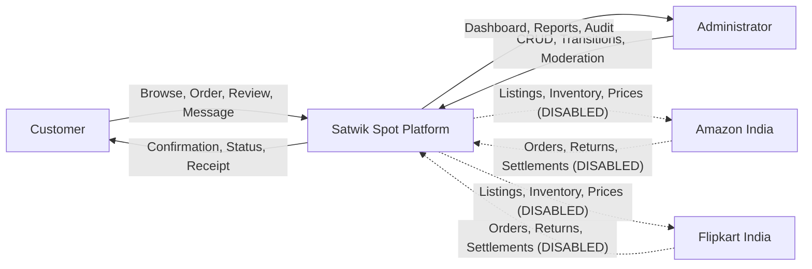
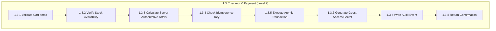

# DATA FLOW DIAGRAMS (PHASE 10A — COMPLETE)

**Project**: Satwik Sweets and Pickels  
**Scope**: Level 0, Level 1 & Level 2 Data Flow Diagrams (Render Backend & Firebase Staging)  
**Date**: July 20, 2026  

---

## Level 0 — Context Diagram

---

## Level 1 — Major Process Flows

```mermaid
graph TB
    subgraph "1.0 Customer Ordering"
        P1["1.1 Browse Catalog"]
        P2["1.2 Cart Management"]
        P3["1.3 Checkout & Payment"]
        P4["1.4 Order Tracking"]
    end

    subgraph "2.0 Admin Operations"
        P5["2.1 Product & Inventory CRUD"]
        P6["2.2 Order Status Transitions"]
        P7["2.3 Message Management"]
        P8["2.4 Review Moderation"]
        P9["2.5 Audit & Dashboard"]
    end

    subgraph "3.0 Marketplace Sync (DISABLED)"
        P10["3.1 Listing Sync"]
        P11["3.2 Inventory Propagation"]
        P12["3.3 Order Import"]
        P13["3.4 Settlement Reconciliation"]
    end

    DS_PRODUCTS[("Products")]
    DS_ORDERS[("Orders")]
    DS_MESSAGES[("Messages")]
    DS_REVIEWS[("Reviews")]
    DS_INVENTORY[("Inventory Ledger")]
    DS_AUDIT[("Audit Logs")]

    P1 --> DS_PRODUCTS
    P3 --> DS_ORDERS
    P5 --> DS_PRODUCTS
    P5 --> DS_INVENTORY
    P6 --> DS_ORDERS
    P6 --> DS_AUDIT
    P7 --> DS_MESSAGES
    P8 --> DS_REVIEWS
    P9 --> DS_AUDIT
    P10 -.-> DS_PRODUCTS
    P11 -.-> DS_INVENTORY
    P12 -.-> DS_ORDERS
```

---

## Level 2 — Order Processing Detail

---
*End of Data Flow Diagrams.*
