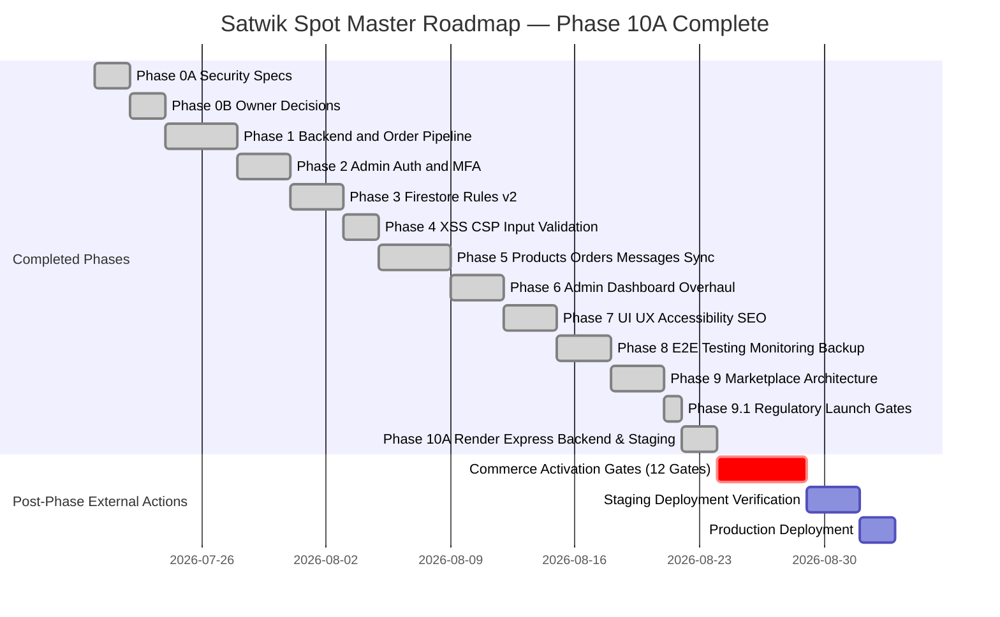

# IMPLEMENTATION ROADMAP (PHASE 10A COMPLETED)

**Project**: Satwik Sweets and Pickels  
**Strategy**: Security-First Architecture, Server-Authoritative Pipeline, Rules v2, Safe DOM, Admin Dashboard, Accessible UI/UX, E2E Verification, Marketplace Architecture, Regulatory Gates & Render Staging Backend Migration  
**Date**: July 20, 2026 (Phase 10A Completed)  

---

## 1. Master Phase Schedule & Status

---

## 2. Phase Status Breakdown

| Phase | Description | Status | Tests |
| :--- | :--- | :--- | :---: |
| **Phase 0A** | Security Specs & Emulator Test Design | **COMPLETED** | — |
| **Phase 0B** | Owner Decisions (Guest Checkout, Backend, Provisioning CLI) | **APPROVED** | — |
| **Phase 1** | Trusted Backend & Authoritative Order Pipeline (Node 22) | **COMPLETED & VERIFIED** | 14 |
| **Phase 2** | Firebase Auth Admin Provisioning, MFA, Separate Portal | **COMPLETED & VERIFIED** | 22 |
| **Phase 3** | Firestore Rules v2 & Emulator Tests (Default-Deny) | **COMPLETED & VERIFIED** | 52 |
| **Phase 4** | XSS, CSP & Input Validation (Zero innerHTML, Strict CSP) | **COMPLETED & VERIFIED** | 25 |
| **Phase 5** | Products, Orders, Messages & Reviews Synchronization | **COMPLETED & VERIFIED** | 45 |
| **Phase 6** | Admin Dashboard (CRUD, State Machine, Permissions) | **COMPLETED & VERIFIED** | 50 |
| **Phase 7** | UI/UX, Accessibility (WCAG 2.2 AA), Responsive, SEO | **COMPLETED & VERIFIED** | 24 |
| **Phase 8** | E2E Testing, Monitoring, Backup & Deployment Preflight | **COMPLETED & VERIFIED** | 57 |
| **Phase 9** | Amazon/Flipkart Marketplace-Readiness Architecture | **COMPLETED & VERIFIED** | 37 |
| **Phase 9.1** | Regulatory-Pending Launch Gates & Staging Isolation | **COMPLETED & VERIFIED** | 10 |
| **Phase 10A** | Render Standalone Express Backend & Firebase Staging Setup | **COMPLETED & VERIFIED** | 30 |
| | | **GRAND TOTAL** | **366** |

---

## 3. Post-Phase External Actions Required

All 9 development phases and regulatory-pending gates are complete. The following actions require explicit owner authorization and external account/credential setup before any staging or production deployment:

1. Pass all 12 gates in [`COMMERCE_ACTIVATION_CHECKLIST.md`](file:///u:/SatvikSwad/COMMERCE_ACTIVATION_CHECKLIST.md)
2. Owner provides legal/business content (`OWNER_CONTENT_REQUIRED.md`)
3. Firebase billing confirmed (Blaze plan)
4. Staging Firebase project provisioned
5. Production Firebase project confirmed
6. MFA enrolled for admin accounts
7. App Check production key registered
8. Monitoring alert recipients configured
9. Marketplace seller accounts registered (Amazon/Flipkart)
10. FSSAI licence and GSTIN documents confirmed by owner

---
*End of Implementation Roadmap.*
