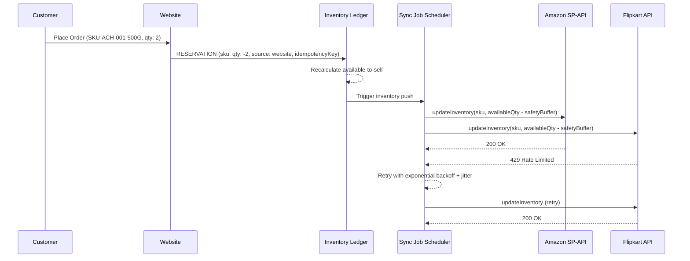

# INVENTORY LEDGER AND SYNCHRONIZATION DESIGN

**Project**: Satwik Sweets and Pickels  
**Scope**: Cross-Channel Inventory Source of Truth, Safety Buffer & Overselling Prevention  
**Date**: July 19, 2026  

---

## 1. Inventory Flow Diagram



---

## 2. Available-to-Sell Calculation

```
available_to_sell = physical_stock
                  - reserved_website
                  - reserved_amazon
                  - reserved_flipkart
                  - safety_buffer
```

- **Safety Buffer**: Configurable per-SKU (default: 2 units). Prevents last-unit overselling across channels during sync propagation delay.
- **Negative Prevention**: Ledger transaction rejects any operation that would result in `available_to_sell < 0`.

---

## 3. Ledger Event Types

| Event Type | Signed Quantity | Trigger |
| :--- | :--- | :--- |
| `reservation` | Negative | Order placed on any channel |
| `deduction` | Negative | Order confirmed / shipped |
| `release` | Positive | Order cancelled before shipment |
| `adjustment` | +/- | Manual admin stock correction |
| `return_sellable` | Positive | Return inspection: item is resellable |
| `return_damaged` | Zero (logged only) | Return inspection: item damaged/expired — **never** auto-returned to sellable stock |

---

## 4. API Outage Behavior

| Scenario | Behavior |
| :--- | :--- |
| Marketplace API unreachable | Sync job enters `failed` state. Retry with exponential backoff (max 5 attempts). |
| Retry exhaustion | Job moves to `dead_letter` status. Admin notified. Manual reconciliation required. |
| Stale channel quantity | Internal ledger remains authoritative. Channel receives corrected quantity on next successful sync. |

---
*End of Inventory Ledger and Synchronization Design.*
