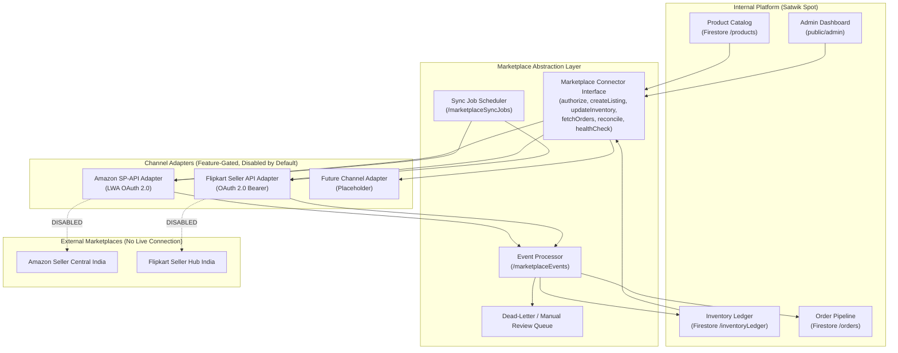

# MARKETPLACE ARCHITECTURE

**Project**: Satwik Sweets and Pickels  
**Scope**: Marketplace-Neutral Multi-Channel Integration Architecture  
**Date**: July 19, 2026 (Corrected: Amazon authorization model updated)  

---

## 1. Architecture Overview

---

## 2. Key Architectural Principles

1. **Feature-Gated by Default**: Every marketplace connector is behind a disabled feature flag. Only owners may enable connectors after verified seller account authorization.
2. **Marketplace-Neutral Business Logic**: Core ordering, inventory, and pricing logic never depend directly on Amazon or Flipkart payload formats. Channel adapters translate between marketplace-specific and internal normalized models.
3. **Internal SKU as Primary Key**: Marketplace identifiers (ASIN, FSN) are stored as references but never replace internal product or variant IDs.
4. **Inventory Ledger as Source of Truth**: All stock changes (sales, reservations, returns, adjustments) flow through the internal ledger before propagating to external channels.
5. **Idempotent Event Processing**: Every marketplace event carries a deduplication key. Duplicate processing produces no side effects.
6. **Secret Isolation**: Marketplace OAuth tokens (LWA Client Secret, Refresh Tokens, Access Tokens) are stored exclusively in Secret Manager or equivalent approved secret storage. They never enter Firestore browser-readable collections, frontend bundles, server logs, or Git.

---

## 3. Connector Lifecycle States

| State | Description |
| :--- | :--- |
| `disabled` | Default. No API calls, no credential storage, UI shows "Not Connected". |
| `authorizing` | Owner has initiated self-authorization or OAuth flow. Awaiting token storage. |
| `connected` | Valid credentials stored in Secret Manager. Sync jobs may execute. |
| `suspended` | Owner or system has paused sync (e.g. during inventory audit). |
| `error` | Repeated failures exceeded threshold. Requires manual review. |
| `revoked` | Credentials invalidated. Full re-authorization required. |

---
*End of Marketplace Architecture Document.*
