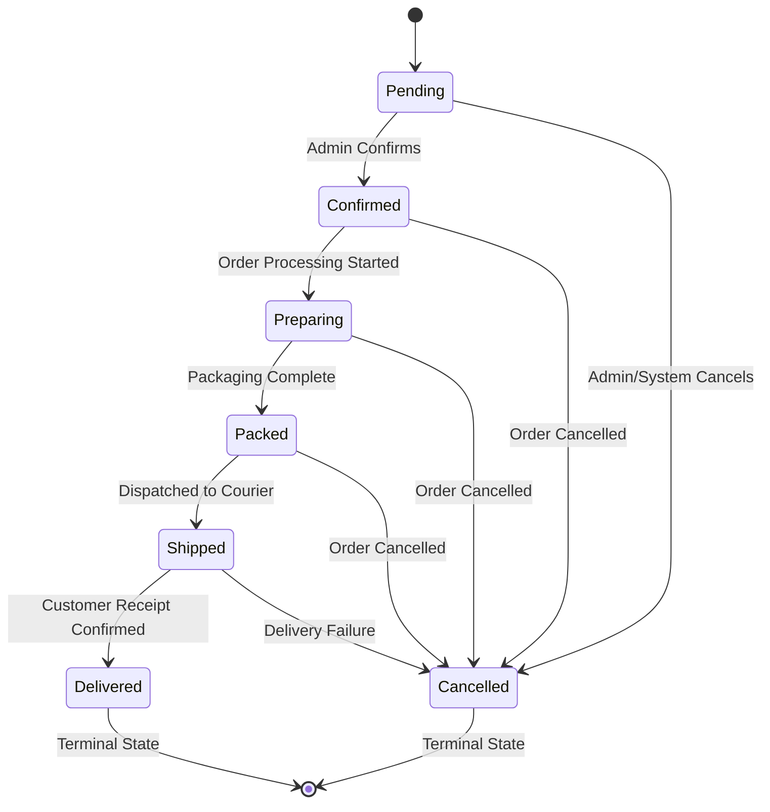

# ORDER STATUS TRANSITION MATRIX

**Project**: Satwik Sweets and Pickels  
**Scope**: Server-Enforced Order State Machine  
**Date**: July 19, 2026  

---

## 1. Permitted Transition Table

| Current Status | Permitted Next Statuses | Terminal? | Payment Status Effect |
| :--- | :--- | :---: | :--- |
| **`Pending`** | `Confirmed`, `Cancelled` | No | `COD_Pending` / `Unpaid` |
| **`Confirmed`** | `Preparing`, `Cancelled` | No | Retains status |
| **`Preparing`** | `Packed`, `Cancelled` | No | Retains status |
| **`Packed`** | `Shipped`, `Cancelled` | No | Retains status |
| **`Shipped`** | `Delivered`, `Cancelled` | No | Retains status |
| **`Delivered`** | *None* | **YES** | Automatically updated to `Paid` |
| **`Cancelled`** | *None* | **YES** | Retains status |

> [!CAUTION]
> **Transition Rules**: Skipping states (e.g. `Pending` directly to `Delivered`) or executing backward transitions is **REJECTED** with HTTP 400 `INVALID_STATUS_TRANSITION`.

---
*End of Order Status Transition Matrix.*
