# SYSTEM ARCHITECTURE (PHASE 10A — COMPLETE)

**Project**: Satwik Sweets and Pickels  
**Scope**: System Architecture with Standalone Render Backend & Firebase Staging Setup  
**Date**: July 20, 2026  

---

## 1. Complete System Architecture Diagram

```mermaid
graph TB
    subgraph "Public Internet"
        BROWSER["Customer Browser"]
        ADMIN_BROWSER["Admin Browser"]
    end

    subgraph "Firebase Hosting"
        SITE["Public Storefront<br/>(public/site)<br/>satvik-spot-staging.web.app"]
        ADMIN_SITE["Private Admin Portal<br/>(public/admin)<br/>satvik-spot-staging-admin.web.app"]
    end

    subgraph "Render Web Service (Node.js 22 + Express)"
        SERVER["Standalone Express Backend<br/>(0.0.0.0:8080)"]
        HEALTH["GET /health & GET /ready"]
        ORDERS_API["POST /api/v1/orders/create"]
        ADMIN_API["/api/v1/admin/*"]
    end

    subgraph "Firebase Staging Project (satvik-spot-staging)"
        AUTH["Firebase Authentication"]
        APPCHECK["Firebase App Check"]
        FIRESTORE["Cloud Firestore<br/>(Default-Deny Rules v2)"]
    end

    subgraph "Firestore Collections"
        PRODUCTS["/products"]
        ORDERS_COL["/orders + /orders/events"]
        MSGS["/messages"]
        REVS["/reviews"]
        AUDIT["/audit_logs"]
        IDEM["/idempotency"]
        RATE["/rate_limits"]
    end

    subgraph "Marketplace Integration Layer (Feature-Gated)"
        MKTPLACE_IF["Marketplace Connector Interface"]
        AMAZON_ADAPT["Amazon SP-API Adapter<br/>(DISABLED)"]
        FLIPKART_ADAPT["Flipkart Seller API Adapter<br/>(DISABLED)"]
        INV_LEDGER["/inventoryLedger"]
        MKT_LISTINGS["/marketplaceListings"]
        MKT_ORDERS["/marketplaceOrders"]
        MKT_EVENTS["/marketplaceEvents"]
        MKT_SETTLE["/marketplaceSettlements"]
        MKT_SYNC["/marketplaceSyncJobs"]
        MKT_CHANNELS["/marketplaceChannels"]
    end

    subgraph "External (No Live Connection)"
        AMZ_EXT["Amazon Seller Central India"]
        FK_EXT["Flipkart Seller Hub India"]
        SECRET_MGR["Google Cloud Secret Manager"]
    end

    BROWSER --> SITE
    ADMIN_BROWSER --> ADMIN_SITE
    SITE --> AUTH
    SITE --> APPCHECK
    SITE --> FUNCTIONS
    ADMIN_SITE --> AUTH
    ADMIN_SITE --> FUNCTIONS

    FUNCTIONS --> HEALTH
    FUNCTIONS --> ORDERS_API
    FUNCTIONS --> MESSAGES_API
    FUNCTIONS --> REVIEWS_API
    FUNCTIONS --> ADMIN_API

    ORDERS_API --> FIRESTORE
    MESSAGES_API --> FIRESTORE
    REVIEWS_API --> FIRESTORE
    ADMIN_API --> FIRESTORE

    FIRESTORE --> PRODUCTS
    FIRESTORE --> ORDERS_COL
    FIRESTORE --> MSGS
    FIRESTORE --> REVS
    FIRESTORE --> AUDIT
    FIRESTORE --> IDEM
    FIRESTORE --> RATE

    ADMIN_API --> MKTPLACE_IF
    MKTPLACE_IF --> AMAZON_ADAPT
    MKTPLACE_IF --> FLIPKART_ADAPT
    MKTPLACE_IF --> INV_LEDGER
    MKTPLACE_IF --> MKT_LISTINGS
    MKTPLACE_IF --> MKT_ORDERS
    MKTPLACE_IF --> MKT_EVENTS
    MKTPLACE_IF --> MKT_SETTLE
    MKTPLACE_IF --> MKT_SYNC
    MKTPLACE_IF --> MKT_CHANNELS

    AMAZON_ADAPT -.->|"DISABLED"| AMZ_EXT
    FLIPKART_ADAPT -.->|"DISABLED"| FK_EXT
    AMAZON_ADAPT -.-> SECRET_MGR
    FLIPKART_ADAPT -.-> SECRET_MGR
```

---

## 2. Hosting Target Configuration

| Target | Directory | Domain | Access |
| :--- | :--- | :--- | :--- |
| `site` | `public/site` | `satwikspot.web.app` | Public — no admin links |
| `admin` | `public/admin` | `admin.satwikspot.com` | Private — requires `admin: true` claim |

---

## 3. Security Layers

1. **Transport**: HTTPS/TLS enforced via Firebase Hosting.
2. **Authentication**: Firebase Auth with custom claims (`admin: true`, role array).
3. **App Check**: reCAPTCHA v3 token verification (production enforcement).
4. **Authorization**: Backend middleware verifies claim + role per endpoint.
5. **Firestore Rules v2**: Default-deny with explicit per-collection match blocks.
6. **Input Validation**: Server-side schema validation, unknown-field rejection.
7. **Rate Limiting**: Distributed Firestore-backed sliding window.
8. **Idempotency**: Payload-bound deduplication keys.
9. **CSP**: `default-src 'self'`, no `unsafe-eval`, no wildcard `*`.
10. **DOM Safety**: Zero `innerHTML` concatenation for user/database data.
11. **Audit Trail**: Append-only `/audit_logs` (backend-written, browser read-only for owner).

---
*End of System Architecture.*
