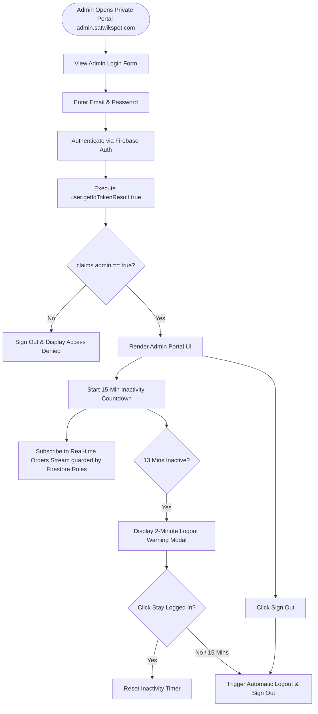

# USER AND ADMIN FLOWS (PHASE 2 REVISED)

**Project**: Satwik Sweets and Pickels  
**Scope**: Separate Admin Portal Navigation, Token Claims Verification & Session Controls  
**Date**: July 19, 2026 (Phase 2 Completed)  

---

## 1. Separate Admin Portal Workflow Diagram (Mermaid)

---

## 2. Public Storefront Workflow (No Admin Exposure)

- Public storefront (`index.html`) contains **zero** admin login buttons, links, or fallback forms.
- All order placement requests flow to the trusted backend pipeline (`/api/v1/orders/create`).

---
*End of Revised User and Admin Flow Document.*
