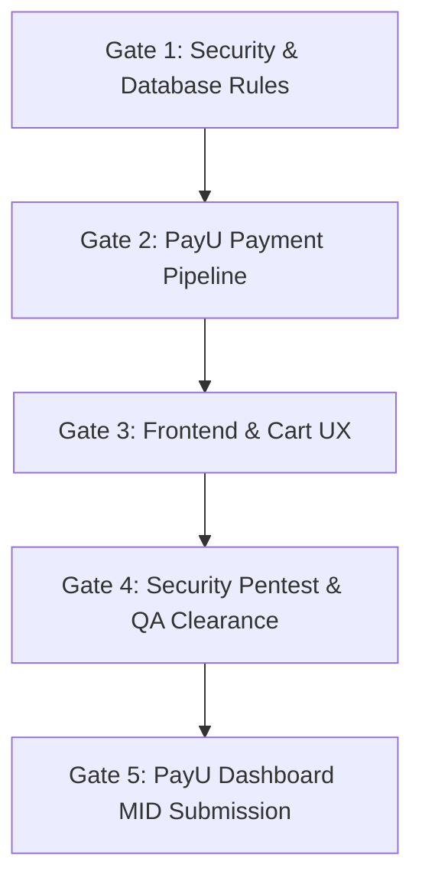

# Implementation Plan — Satvik Swaad Web Production, Security & Multi-Agent Execution

This plan translates the entire **`SATVIK_SWAAD_WEB_PRODUCTION_AND_MULTI_AGENT_BLUEPRINT.md`** into an actionable, rigorous engineering roadmap. We do not alter or dilute any specifications from the blueprint; instead, we implement all 6 Golden Pillars and orchestrate the 8 Autonomous AI Agents according to the 3-phase execution model.

---

## 🏛️ Architecture & System Blueprint Mapping

```
                                 [ Agent 0: Lead Architect & Project Planner ]
                                                      │
                     ┌────────────────┬───────────────┼───────────────┬────────────────┐
                     ▼                ▼               ▼               ▼                ▼
                [ Agent 1 ]      [ Agent 2 ]     [ Agent 3 ]     [ Agent 4 ]      [ Agent 5 ]
                 Backend &           PayU        Database &       Frontend &         Legal &
                 Security          Pipeline         BOLA           Cart UX         Compliance
                     │                │               │               │                │
                     └────────────────┴───────────────┼───────────────┴────────────────┘
                                                      │
                                       ┌──────────────┴──────────────┐
                                       ▼                             ▼
                                  [ Agent 6 ]                   [ Agent 7 ]
                               Security Pentester               QA & Flow
                                & Audit Monitor               Audit Monitor
```

---

## 🔍 Codebase Gap Analysis vs Blueprint

| Blueprint Requirement | Current Codebase State | Action Required | Responsible Agent |
| :--- | :--- | :--- | :--- |
| **Pillar 1: Server-Authoritative Pricing** | `orderService.ts` fetches live product prices & calculates subtotal/shipping server-side. | Ensure PayU order endpoint reuses this exact calculation; client never dictates amounts. | **Agent 0 & Agent 2** |
| **Pillar 2: PayU Cryptographic Pipeline** | Razorpay integration exists (`razorpayService.ts`), PayU is completely absent. | Build `payuService.ts`, compute SHA-512 request hash, SURL/FURL reverse hash verification with `crypto.timingSafeEqual`, 5-min idempotency lock. | **Agent 2** |
| **Pillar 3: BOLA Database Security** | `firestore.rules` has basic `isOwner(userId)` and `orders allow write: if false`. | Add strict `wallet`/`role` immutability locks, protect `/users/{userId}/addresses`, lock `/paymentAuditLog` to server-only. | **Agent 3** |
| **Pillar 4: Node/Express Hardening** | Basic rate limiting & headers in `app.ts`. | Add PayU domains to Helmet CSP (`checkout.payu.in`, `secure.payu.in`), 10 req/min on checkout rate limiter, safe fallback secret generation with `crypto.randomBytes(32)`. | **Agent 1** |
| **Pillar 5: Fluent & Fast Frontend UX** | Cart modal and vanilla JS exist in `script.js` & `cart.html`. | Implement client-side `payuService.js` form auto-post, optimistic cart updates with rollback, 360px mobile checkout rail, and PWA manifest. | **Agent 4** |
| **Pillar 6: PayU Legal Compliance** | Policy pages modernized, but operating entity details and Merchant Card with FSSAI need formalization. | Add registered entity details, FSSAI merchant card, and strict perishable food return clause (2-4 hrs report, 5-7 days refund). | **Agent 5** |
| **Security Audit & Pentest** | Unit tests exist in `backend/tests`. | Build automated penetration testing scripts simulating price tampering, BOLA/IDOR, webhook hash forgery, and clickjacking. | **Agent 6** |
| **End-to-End QA & Flow Audit** | Viewport QA scripts exist. | Build end-to-end checkout journey tests, rapid duplicate click tests (idempotency), and 360px mobile viewport verification. | **Agent 7** |

---

## 🛠️ Phase-by-Phase Implementation Plan

### Phase 1: Foundations (Day 1) — Security & Database Hardening
#### 1. Agent 1: Server & API Security Hardening
- **Target File**: `backend/src/app.ts`, `backend/src/config/cors.ts`, `backend/src/config/environment.ts`
- Update Content Security Policy (CSP) in `app.ts` to whitelist PayU endpoints:
  - `script-src`: `'self'`, `https://checkout.payu.in`, `https://secure.payu.in`, `https://test.payu.in`
  - `connect-src`: `'self'`, `https://secure.payu.in`, `https://test.payu.in`, `https://info.payu.in`
  - `frame-src`: `'self'`, `https://secure.payu.in`, `https://test.payu.in`
  - `form-action`: `'self'`, `https://secure.payu.in`, `https://test.payu.in`
- Add safe fallback secret generation:
  ```typescript
  const fallbackSecret = crypto.randomBytes(32).toString('hex');
  const sessionSecret = process.env.SESSION_SECRET || fallbackSecret;
  ```
- Implement Express Rate Limiting: 100 req/min on general `/api/v1/`, strict 10 req/min on `/api/v1/payments/payu/create-order`.

#### 2. Agent 3: Database & BOLA Security Specialist
- **Target File**: `firestore.rules`
- Enforce strict rules for `/users/{userId}`:
  ```javascript
  allow update: if isOwner(userId) && 
    (!('wallet' in request.resource.data) || request.resource.data.wallet == resource.data.wallet) &&
    (!('role' in request.resource.data) || request.resource.data.role == resource.data.role) &&
    (!('admin' in request.resource.data));
  ```
- Restrict `/users/{userId}/addresses/{addressId}`: Only `isOwner(userId)` can read and write.
- Restrict `/orders/{orderId}`: `allow write: if false;` (Clients cannot mutate or forge orders).
- Restrict `/paymentAuditLog/{auditId}`: `allow read, write: if false;` (Server-only append log).

---

### Phase 2: Core Engine (Day 2) — PayU Gateway & Legal Compliance
#### 1. Agent 2: PayU Payment Gateway Pipeline
- **Target Files**:
  - `backend/src/payments/payuService.ts` [NEW]
  - `backend/src/payments/payuSchema.ts` [NEW]
  - `backend/src/payments/paymentController.ts` [MODIFY]
  - `backend/src/config/environment.ts` [MODIFY]
- **PayU Configuration**:
  - `PAYU_MERCHANT_KEY`, `PAYU_MERCHANT_SALT`, `PAYU_ENV` (`TEST` or `PROD`), `PAYU_BASE_URL` (`https://secure.payu.in` or `https://test.payu.in`).
- **Endpoint 1: `POST /api/v1/payments/payu/create-order`**:
  - Validates cart items, calculates server-authoritative `subtotal`, `shippingFee` (₹0 if >= ₹499, else ₹50), and `total`.
  - Transaction ID format: `satvik_ord_${Date.now()}_${crypto.randomBytes(4).toString('hex')}`.
  - Generates SHA-512 request hash:
    `sha512(key|txnid|amount|productinfo|firstname|email|udf1|udf2|udf3|udf4|udf5||||||SALT)`
  - 5-Minute Idempotency Lock: If a pending order exists with identical cart and customer within 5 minutes, reuse the session.
- **Endpoint 2: `POST /api/v1/payments/payu/response` (SURL / FURL)**:
  - Verifies reverse hash using `crypto.timingSafeEqual`:
    `sha512(SALT|status||||||udf5|udf4|udf3|udf2|udf1|email|firstname|productinfo|amount|txnid|key)`
  - On status `success`, atomically marks order as `PAID`, logs transaction in `/paymentAuditLog`, and redirects to `/order-success.html?orderId=...`.
  - On failure/tamper, marks order as `FAILED` and redirects to `/payment-failed.html?reason=...`.

#### 2. Agent 5: Legal & Payment Compliance
- **Target Files**:
  - `public/site/terms-and-conditions.html`
  - `public/site/privacy-policy.html`
  - `public/site/cancellation-refund-policy.html`
  - `public/site/contact.html`
- Include formal operating entity: *"Satvik Swaad is operated by [Proprietor/Company Name], Registered Commercial Address: Varanasi, Uttar Pradesh, India"*.
- Perishable Food Refund Clause: Damaged or defective items must be reported within **2–4 hours** of delivery with photo/video proof; approved refunds credited in **5–7 business days** to original source via PayU.
- Contact/About Us Screen: Embed **Merchant Identification Card** featuring Proprietor Name, FSSAI Registration Number (`FSSAI: 22724113000000` / format compliant), Official Helpline, Support Email, and Physical Registered Address.

---

### Phase 3: Polish & Launch (Day 3) — Frontend UX, Pentest & QA Monitors
#### 1. Agent 4: High-Performance Frontend & Cart Architect
- **Target Files**:
  - `public/site/js/payuService.js` [NEW]
  - `public/site/script.js` [MODIFY]
  - `public/site/cart.html` [MODIFY]
  - `public/site/manifest.json` [NEW/MODIFY]
- Implement seamless PayU standard form injection and auto-submission:
  - Dynamically constructs hidden form with PayU params (`key`, `txnid`, `amount`, `productinfo`, `firstname`, `email`, `phone`, `surl`, `furl`, `hash`).
  - Automatically posts to PayU gateway.
- Optimistic Cart UI: Instant quantity adjustments with rollback on network failure.
- Sticky mobile checkout rail on 360px–420px viewports with touch targets >= 44px.

#### 2. Agent 6: Security Auditor & Penetration Tester (Monitor)
- **Target File**: `tests/security/payu-security-pentest.test.ts` [NEW]
- **Pentest 1: Price Tampering Attack**: Send altered cart payload (`amount: 1` instead of ₹500). Verify backend calculates authoritative price and rejects client-provided amount.
- **Pentest 2: BOLA / IDOR Attack**: Attempt to read foreign customer's order `/orders/{otherId}` via another user's token. Verify Firestore returns `permission-denied`.
- **Pentest 3: Webhook Hash Forgery**: Send fake PayU success webhook with incorrect salt/hash. Verify backend rejects with HTTP 400.
- **Pentest 4: Clickjacking & XSS**: Verify iframe embedding is blocked (`X-Frame-Options: DENY`, `frame-ancestors 'none'`).

#### 3. Agent 7: Flow Verification & QA Monitor (Monitor)
- **Target File**: `tests/e2e/qa-payu-checkout-flow.js` [NEW]
- Validate complete purchase flow: Cart ➔ Address selection ➔ PayU Order ➔ Success/Failure redirect.
- Rapid duplicate click test: Rapidly fire 3 checkout clicks in 200ms, verifying only 1 order session is created (5-minute idempotency guard).
- Viewport verification on 360px mobile screen (zero overflow, touch targets >= 44px).

---

## 🚦 Milestone Verification Gates



1. **Gate 1 Clearance**: `firestore.rules` emulator tests pass + Helmet CSP / Rate Limiting verified via curl.
2. **Gate 2 Clearance**: PayU SHA-512 hash calculation matches PayU documentation + SURL/FURL timingSafeEqual verification passes.
3. **Gate 3 Clearance**: Cart drawer loads in < 1s + PayU checkout form auto-submits reliably + 360px mobile view verified.
4. **Gate 4 Clearance**: Agent 6 Pentest Report (0 vulnerabilities) + Agent 7 QA Report (100% test passes).
5. **Gate 5 Clearance**: Website submitted to PayU onboarding dashboard for 1st-attempt approval.
